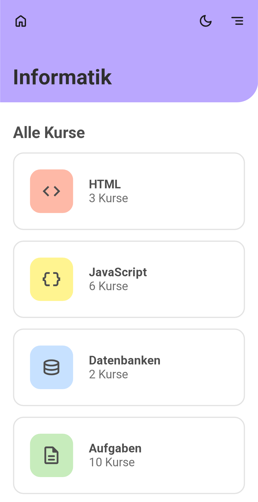
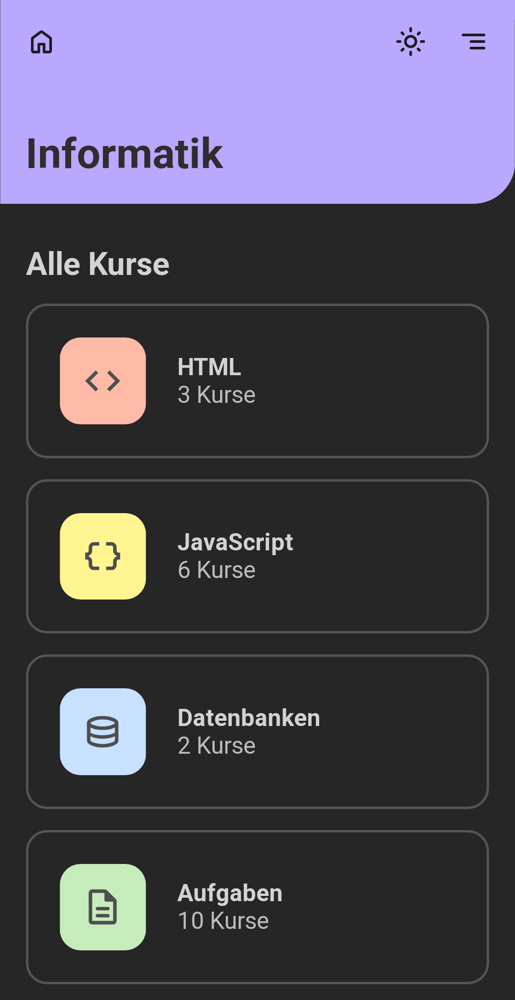
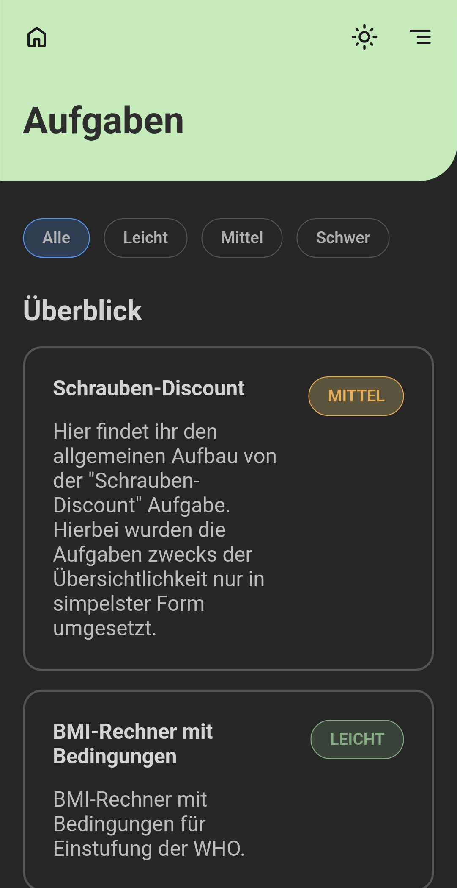

# Übungsseite für HTML und JavaScript

> Hier findet ihr die Grundlagen zu HTML, JavaScript und Datenbanken. 
> Außerdem gibt es noch Lösungen für Übungsaufgaben.

---

Diese [Webseite](https://daborsten.github.io/informatik/) kann außerdem als App installiert werden und somit auch Offline verwendet werden.

